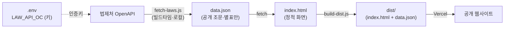

# 국가·지방 계약법령 비교 서비스

국가계약법령과 지방계약법령의 **같은 주제 조항**을 **법률·시행령·시행규칙 3계층**으로 좌우 비교하고,
두 조항의 차이를 **'핵심 차이 요약'(사실 기반)** 으로 한눈에 확인하는 웹앱입니다.

**▶ 라이브 데모: https://my-app-silk-chi-22.vercel.app**

> ⚖️ 이 앱은 **'비교'만** 합니다. 법률 해석·자문은 하지 않습니다(유권해석은 사람의 몫).
> 핵심 차이 요약은 **문구·수치의 기계적 대조 결과**이며 법적 효력이 없습니다.

---

## 목차

- [왜 만들었나](#왜-만들었나)
- [주요 기능](#주요-기능)
- [비교 주제와 조문 매핑](#비교-주제와-조문-매핑)
- [화면 구성과 사용법](#화면-구성과-사용법)
- [아키텍처와 데이터 흐름](#아키텍처와-데이터-흐름)
- [프로젝트 구조](#프로젝트-구조)
- [로컬에서 실행](#로컬에서-실행)
- [법령 데이터 수집·갱신](#법령-데이터-수집갱신)
- [배포 (Vercel)](#배포-vercel)
- [보안·개인정보](#보안개인정보)
- [기술 스택](#기술-스택)
- [개발 원칙](#개발-원칙)
- [비범위](#비범위-만들지-않음)
- [데이터 출처 및 면책](#데이터-출처-및-면책)

---

## 왜 만들었나

국가계약법령(**재정경제부** 소관)과 지방계약법령(**행정안전부** 소관)은 관장 부처가 달라,
같은 주제라도 두 법령을 각각 열어 **일일이 수작업으로 대조**해야 하는 불편이 있었습니다.

- **대상 사용자**: 재정경제부·행정안전부의 계약제도 담당자
- **해결하는 문제**: 제도 정비·질의응답 과정에서 국가/지방 계약의 차이를 빠르고 정확하게 확인
- **화면 기준**: 좌우 비교 구조상 **PC(데스크톱) 최적화** (모바일 대응은 범위 외)

### 기존 방식의 한계

| 한계 | 내용 |
|------|------|
| 시간 | 두 문서를 번갈아 봐야 해 대조에 시간이 오래 걸림 |
| 누락 | 문구의 미세한 차이를 사람 눈으로 찾다 놓치기 쉬움 |
| 반복 | 대응 조항 위치를 매번 다시 찾는 반복 업무 |
| 편차 | 담당자마다 대조 결과가 달라져 일관성 저하 |

---

## 주요 기능

### 1. 주제 선택 → 3계층 좌우 비교
드롭다운에서 주제를 고르면 **법률·시행령·시행규칙 3계층**이 한 화면에 세로로 쌓여, 계층마다 **좌=국가 / 우=지방**으로 고정 비교됩니다. 조항은 조문 번호가 아니라 **'비교 주제'를 기준으로** 짝짓습니다. 대응 조항이 없으면 **"해당 조항 없음"**, 두 조문이 완전히 같으면 **"차이 없음"** 배지를 표시합니다.

### 2. 핵심 차이 요약 (사실 기반)
3계층을 통합해 **핵심 차이 표 1개**를 최상단에 배치합니다. 주제 성격에 따라 대조 방식이 다릅니다.

- **제재 주제**(입찰참가자격 제한·과징금·지체상금): 별표·조문에서 **정량 제재수준**(제재기간·부과율·요율)을 추출해, 행위·사유·계약종류 **분류별로 국가 vs 지방**을 대조합니다.
- **보증금 주제**(입찰보증금·계약보증금): **요율·납부수단·면제/대상** 3측면을 키워드로 대조합니다. 준용(다른 조문 준용) 처리와 표기 정규화(예: 증권⊇상장증권, 공공기관⊇공기업)로 **허위 차이를 방지**합니다.
- 대조 표 제목에 **"차이 N건" 배지**(차이 없으면 초록 "차이 없음")로 차이 규모를 즉시 표시합니다.
- 차이 판정에는 **단어 단위 LCS**를 사용하며, 개정·신설·삭제 등 `<…>` 표기는 대조에서 제외합니다.

> **최근 반영 예시** — 계약보증금: 국가계약법 시행령 제50조 ⑤(신설 2026.5.12)로 *집행정지 결정 후 낙찰 시 계약보증금 100분의 10 추가 납부(할증)* 조항이 생겼으나 지방계약법 시행령에는 대응 규정이 없어, 이 차이를 핵심 차이로 표시합니다.

### 3. 별표 표시
조문이 참조하는 별표(부정당업자 제한기준표·과징금 부과기준표 등)를 **접이식(기본 접힘, 펼치면 스크롤)** 고정폭 블록으로 함께 표시합니다.

### 4. 동향 살펴보기
주제별로 **관련 조문 안내 + 공식 출처 링크**(법제처 국가법령정보센터 · 국회 의안정보시스템 · 국민참여입법센터)를 새 탭으로 엽니다. **실시간 자동 수집이 아닌 큐레이션 링크**로, 담당자가 개정·발의 동향을 직접 확인하는 출발점입니다.

---

## 비교 주제와 조문 매핑

현재 5개 주제를 비교하며, 각 주제는 3계층 × 국가/지방의 조문으로 구성됩니다.
(매핑은 실무 검토를 권장하며, 수정은 `fetch-laws.js`의 `TOPICS`만 고치면 됩니다.)

| 주제 | 법률 (국가/지방) | 시행령 (국가/지방) | 시행규칙 (국가/지방) |
|------|:---:|:---:|:---:|
| 입찰참가자격 제한 | 27 / 31 | 76 / 92 | 76 / 76 |
| 과징금 | 27의2 / 31의2 | 76의2 / 92의2 | 77의2 / 77의2 |
| 지체상금(지연배상금) | 26 / 30 | 74 / 90 | 75 / 75 |
| 입찰보증금 | 9 / 12 | 37 / 37 | 43 / 41 |
| 계약보증금 | 12 / 15 | 50 / **51** | 51 / 49 |

> 계약보증금 지방 시행령은 납부방법(제52조)이 아니라 **제51조(계약의 이행보증)** 에 요율(100분의 10)이 규정되어 있어 그쪽으로 매핑했습니다.

---

## 화면 구성과 사용법

1. 상단 **비교 주제 드롭다운**에서 주제를 선택합니다.
2. 최상단에 **핵심 차이 요약 표**(3계층 통합)가 나타납니다.
3. 그 아래 접이식 **"동향 살펴보기"** 패널이 있습니다.
4. 이어서 **법률 → 시행령 → 시행규칙** 순으로 각 계층의 조문이 좌(국가)·우(지방)로 나란히 표시됩니다.
5. 조문이 참조하는 **별표**는 각 칼럼 아래 접이식으로 펼쳐 볼 수 있습니다.

---

## 아키텍처와 데이터 흐름

법령 데이터는 **법제처(국가법령정보 공동활용) OpenAPI**로 수집합니다. 키 노출·CORS 문제로 브라우저 직접 호출은 부적합하여 **A안(빌드타임 수집)** 을 채택했습니다.



- **키는 빌드타임에만** 사용되고 `data.json`·배포물·브라우저에는 포함되지 않습니다.
- 런타임 앱은 로컬 `./data.json`만 `fetch`하며, 외부로 어떤 데이터도 전송하지 않습니다.

---

## 프로젝트 구조

| 파일 | 설명 |
|------|------|
| `index.html` | 비교 화면(단일 파일 앱). `data.json`을 `fetch`해 렌더링. CSP·XSS 방어 포함. |
| `data.json` | 법령 조문 데이터(3계층 중첩 구조). **공개 조문만** 담김(키 없음). |
| `fetch-laws.js` | 법제처 OpenAPI 수집 스크립트(Node, 의존성 없음). `.env`의 키로 6개 법령을 수집 → `data.json` 생성. |
| `serve.js` | 로컬 확인용 정적 서버(포트 8000, `.env` 서빙 차단·경로 이탈 방지). |
| `build-dist.js` | 배포용 `dist/`(index.html + data.json **2개만**) 생성 스크립트. |
| `vercel.json` | Vercel 배포 설정(빌드=`build-dist.js`, 출력=`dist/`, 보안 헤더). |
| `.env.example` | 인증키 템플릿(값 없음). 실제 `.env`는 커밋 금지. |
| `PRD.md` / `PLAN.md` / `DESIGN.md` / `CHECK.md` | 기획·계획·설계·점검 문서. |

---

## 로컬에서 실행

`index.html`이 `data.json`을 `fetch`하므로 **file:// 더블클릭이 아니라 로컬 서버로 열어야** 실데이터가 보입니다.

```bash
node serve.js
# 브라우저에서 http://127.0.0.1:8000/ 접속
```

---

## 법령 데이터 수집·갱신

법제처 API 인증키(OC)를 발급받아 `.env`에 넣고 수집 스크립트를 실행합니다.

```bash
# 1) .env.example 을 복사해 .env 를 만들고 LAW_API_OC 값을 채운다
cp .env.example .env

# 2) 조문·별표 수집 → data.json 재생성
node fetch-laws.js

# 3) 배포용 dist 재생성(배포할 때만)
node build-dist.js
```

> `.env`는 `.gitignore`로 보호되며 **절대 커밋하지 않습니다.** 키가 실수로 노출되면 즉시 재발급하세요.

---

## 배포 (Vercel)

정적 사이트로 배포합니다. `vercel.json`이 `node build-dist.js`로 **`dist/`(index.html + data.json)만** 빌드·서빙하므로, `.env`·수집 스크립트 등 나머지 파일은 공개되지 않습니다.

- **빌드 명령**: `node build-dist.js` · **출력 디렉터리**: `dist/`
- 런타임에 법제처 API를 호출하지 않으므로 **Vercel 환경 변수(키) 등록 불필요.**
- `vercel.json`에서 보안 헤더를 설정합니다: `X-Content-Type-Options: nosniff`, `Referrer-Policy: no-referrer`, `X-Frame-Options: DENY`, `Strict-Transport-Security`(HSTS).
- **주의**: 폴더를 통째로 올리지 말고 반드시 위 방식(dist만 서빙)으로 배포하세요.

---

## 보안·개인정보

- **비밀 키**: 법제처 인증키는 소스·HTML·커밋에 넣지 않고 오직 `.env`에만 둡니다(`.gitignore`/`.vercelignore` 이중 보호). `data.json`에는 키가 없습니다.
- **XSS 방어**: 외부 데이터(조문·별표·주제명)는 모두 `textContent`로 삽입하며, `innerHTML`은 하드코딩 상수에만 사용합니다.
- **CSP**: `index.html`에 `Content-Security-Policy` 메타로 외부 리소스를 차단하고 자기 출처만 허용합니다.
- **개인정보**: 공개 법령 조문만 다루며 **개인정보를 수집·저장·처리하지 않습니다.** 로그인·쿠키·외부 전송·애널리틱스가 없습니다.

---

## 기술 스택

- **순수 프론트엔드**: `index.html`(HTML + CSS + 바닐라 JS). 프레임워크·빌드·패키지 매니저 **없음**.
- **의존성 없음**: 외부 라이브러리·CDN·npm 패키지 없음. diff(LCS) 로직도 직접 구현.
- **빌드타임 수집**: `fetch-laws.js`(Node 내장 모듈만)로 조문+별표 수집.
- **호스팅**: Vercel(정적).

---

## 개발 원칙

- **검증 루프**: 변경 → 브라우저로 결과 직접 확인 → 스스로 코드 리뷰(도메인·협업 규칙·버그) → 재수정 → 통과 시 "무엇을 왜 바꿨는지" 한 줄 요약.
- **협업 규칙**: 설명·주석은 한국어 / 새 파일은 프로젝트 폴더 안에만 / 비밀 파일은 커밋 금지 / 삭제는 즉시 삭제 대신 `trash-can/`으로 이동 후 사용자 확인.
- 상세 규칙은 [CLAUDE.md](CLAUDE.md), 기획·설계는 [PRD.md](PRD.md)·[DESIGN.md](DESIGN.md), 점검 결과는 [CHECK.md](CHECK.md) 참고.

---

## 비범위 (만들지 않음)

- 국가·지방 계약법령 외 다른 법령(세법·하도급법 등) 비교
- 조항 자동 개정·업데이트 크롤링, 실시간 상시 자동 갱신·모니터링
- AI 자동 유권해석·법률 자문
- 회원가입·로그인·권한관리 등 계정 시스템

---

## 데이터 출처 및 면책

- 조문·별표는 **법제처(국가법령정보 공동활용) OpenAPI**의 **공개 정보**입니다.
- 핵심 차이 요약은 **문구·수치의 기계적 대조 결과**이며 **법적 해석이 아닙니다.** 정확한 맥락은 항상 원문·별표를 확인하세요.
- 조문 매핑은 실무 검토를 권장합니다.
